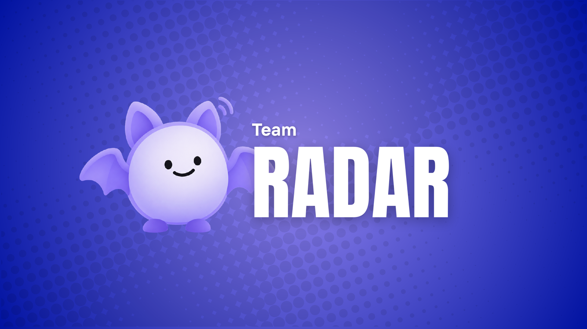
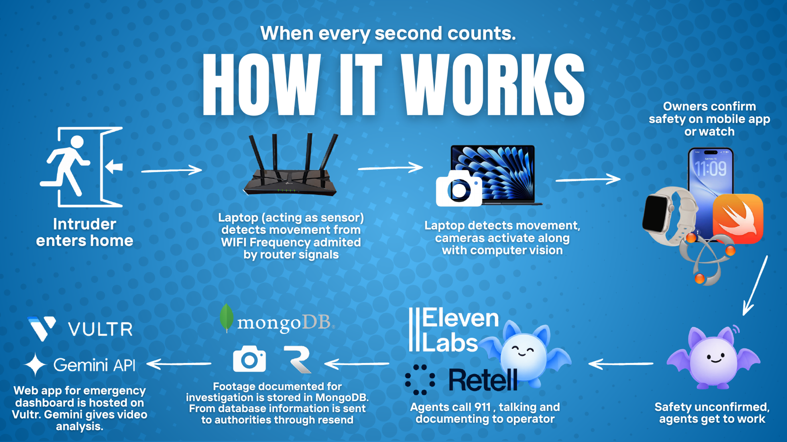
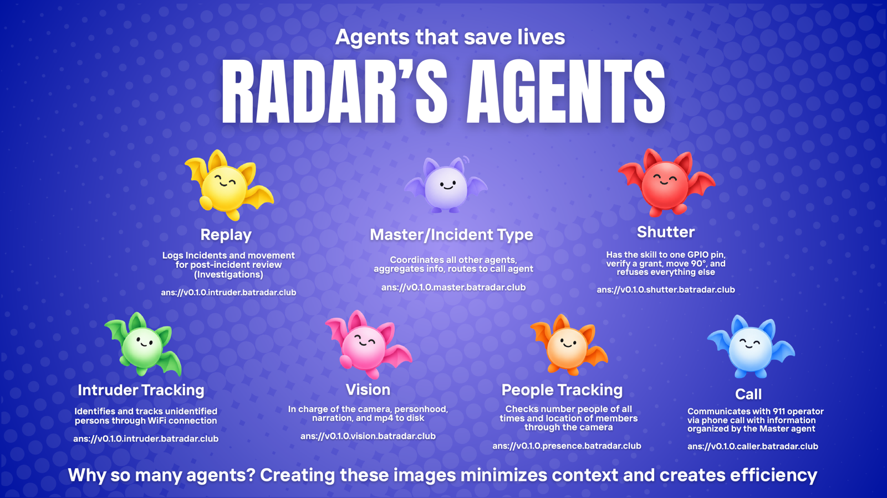

<p align="center">
  
</p>

<h1 align="center">Radar</h1>

<p align="center">
  <b>A home that watches only when it has a reason to, and can prove to 911 that it had one.</b> · Built at VTHacks 14, Virginia Tech, September 18-20 2026.
</p>

<p align="center">
  
  
</p>

---

## Winners

- **2nd place - GoDaddy, Best Use of Agent Name Service (ANS)**
- **1st place - Best UI/UX**

---

## The problem

Between 94% and 98% of police responses to burglar alarms are false.
Departments bill for them, some cities have stopped responding to unverified alarms entirely, and every false dispatch is a unit that some other emergency needed.

The reason is that a normal alarm knows exactly one fact: something moved.
It cannot tell a person from a curtain, a resident from a stranger, or a dog from a break-in, so it escalates on the only signal it has.

At the other end of the call, a 911 dispatcher needs the opposite of that.
911.gov lists what they actually need on arrival: where, what kind of emergency, how many people, what they look like, whether anyone is hurt.
An alarm company can supply none of it.

And there is a privacy cost to fixing it the obvious way.
The system that could answer those questions is a camera that is always recording the inside of your house, which is the thing most people will not install.

## What Radar does

Radar is an emergency response system built from seven independent AI agents, each with its own cryptographic identity, that can answer a dispatcher's questions because it was watching - but only started watching when something gave it a reason to.

A laptop on the home WiFi reads Channel State Information and notices motion.
A servo rotates ninety degrees and pulls a physical shield off a camera lens.
Until that moment the camera cannot see: not "is configured not to record", but cannot see, because there is an opaque object in front of it.

Once the shield clears, a vision agent starts recording and describing what is in the room.
The resident gets that description on their Apple Watch in about three seconds - not "motion detected", but the sentence the camera actually produced.

If they decide it is an emergency, **they** start the incident from their wrist.
Only then does a caller agent dial 911 and hold a conversation in plain English, driven by what the camera is currently seeing.
When the call ends, the whole incident is sealed into a hash-chained record and emailed to the responding department.

### Radar never calls 911 on its own

The only thing that happens without a human is a shutter opening, which is a privacy decision with a privacy-sized consequence.
A person decides that emergency services are needed.

An AI that autonomously summons armed responders to a physical address is a liability problem, a false-positive problem, and an ethics problem.
What the agents do is make sure that when a human does make that call, the dispatcher gets verified information nobody else could give them.

---

## How it works



The demo lives or dies on this budget, and every number has a test behind it.

| t | Event |
|---|---|
| 0.0s | CSI perturbation crosses the motion threshold |
| 0.3s | `presence` emits the motion claim |
| 0.4s | `master` issues the shutter grant; `shutter` verifies it and begins moving |
| 0.8s | Shutter attests open; `vision` opens its Gemini Live session and starts recording |
| ~3.0s | First narration returns, and lands on the watch and phone |
| ~3.0s | `vision.occupancy` returns: `no_person` closes the lens again, `person_present` escalates |
| ~3.3s | `intruder` returns the unaccounted verdict, corroborated by a camera |

---

## The agents



Seven agents, seven hostnames, seven independently registered ANS identities, all live on the public internet.

| Agent | Job | ANSName |
|---|---|---|
| `presence` | Motion, and which room. It cannot tell a person from a curtain and does not try | `ans://v0.1.0.presence.batradar.club` |
| `intruder` | Which person the camera found that no registered device accounts for | `ans://v0.1.0.intruder.batradar.club` |
| `master` | Trust boundary, coordinator, classifier. Issues the shutter grant | `ans://v0.1.0.master.batradar.club` |
| `shutter` | One GPIO pin. Verifies a grant, moves 90 degrees, attests the position, refuses everything else | `ans://v0.1.0.shutter.batradar.club` |
| `vision` | The camera. Personhood, Gemini Live narration, continuous mp4 to disk | `ans://v0.1.0.vision.batradar.club` |
| `caller` | ElevenLabs to the operator, guidance to the resident | `ans://v0.1.0.caller.batradar.club` |
| `replay` | Seals the record, ships it to the police via Resend | `ans://v0.1.0.replay.batradar.club` |

They are reachable right now:

```sh
curl https://master.batradar.club/.well-known/agent-card.json
```

Every agent runs continuously. Nothing spawns on incident.

---

## Why ANS is load-bearing

Radar talks to two humans, and to neither of them over ANS.
The 911 operator hears plain English over a phone call. The resident reads plain English on a watch.
Everything behind those two voices is agent to agent, and every hop of it is ANS-verified.

That asymmetry is the whole architecture, and it produces two claims we can actually defend:

**Identity decides whether a physical object moves.**
`shutter` holds one GPIO pin and an opaque piece of plastic in front of a lens.
It will move that plastic for exactly one reason: a grant from `master`, signed, bound to a nonce `shutter` itself issued, and verified against the key `master` publishes in its own trust card.
An impostor gets a refusal, on stage, visibly.

**The agent that speaks to 911 only repeats claims it can verify.**
Before `caller` says one word to a human being, it verifies the source of every claim it is about to repeat.
When the operator asks a question, it answers from sources it just verified live, not from cached state it cannot vouch for.

Identity is anchored in DNS and TLS rather than in the application layer, where the application can lie about it.
Each incident seals into a transparency log as the call is placed, so a swatting investigation - which is entirely post-hoc - has something to resolve.

### What we do not solve

A malicious agent can still place a 911 call in a convincing synthesized voice, and no operator can tell.
Closing that needs the PSAP side to participate, and no dispatch center runs software we can ship to.
The moment a dispatch center can resolve an ANSName, live verification falls out of what is already built here.

---

## What is real, and what is demonstrated

- `vision` does **not** do face recognition against any database. It describes a person and states whether they match an enrolled resident. We have no database and no lawful basis for one
- Gemini samples video at roughly one frame per second, so the narration is a sequence of observations rather than continuous tracking
- One fixed camera sees one room, and every vision claim carries that room as a field
- The floor plan is authored, not sensed. Walls are the static baseline the sensing subtracts to see motion

Every agent, its ANS identity, its certificate, its card and its contract are real throughout.
`docs/swapping-in-real-parts.md` is the switchboard: every simulated part, where its seam is, and how to flip it.

---

## Repo layout

| Path | What is in it |
|---|---|
| `agents/` | The ANS agent mesh: identities, cards, the A2A transport, and the trust layer |
| `ans/` | ANS registration, card hardening spec, Trust Index work |
| `app/backend/` | The app-facing edge service, claim-envelope defence, sealed replay records |
| `app/ios/` | The iPhone app (SwiftUI, iOS 18, Swift 6) |
| `app/watch/` | The watchOS app: Idle, Notice, Saved. Where a human starts an incident |
| `app/web/` | The `/live` console and the `/replay` investigation console |
| `vision/` | Camera capture, YOLO11m + BoT-SORT tracking, lighting detection, Gemini narration |
| `sensor/` | The WiFi CSI capture path |
| `shutter/` | The servo control path and its grant contract |
| `docs/` | Architecture, threat landscape, hardware guides, research |
| `scripts/up.sh` | Brings the whole system up on one machine, in dependency order |

Stack: Python 3.13, SwiftUI, Gemini API, ElevenLabs + Retell, MongoDB Atlas, Resend, Vultr, Caddy + Let's Encrypt, GoDaddy Registry.

## Running it

```sh
# the agent mesh
cd agents && python -m pytest -q

# the vision path, against real footage
cd vision && python3 -m pytest -q
python3 -m hawkeye_vision

# the whole system, live, in dependency order
./scripts/up.sh            # --fixture for recorded footage, --stop to tear down

# the iOS and watchOS apps
cd app/ios && xcodegen generate
```

One flag, `app/ios/HawkEye/Config.swift`, runs the entire app with no hardware and no agents up.

---

## Team

Cayden Hutcheson · Tri Nguyen · Eric Lee · Josie Sauceda

Pitch deck: [`docs/Radar-deck.pdf`](docs/Radar-deck.pdf)

## Credits

The WiFi sensing layer is a scoped modification of [RuView](https://github.com/ruvnet/ruview) (MIT): we take the capture path and motion detection only.

What is ours: the ANS identity layer, the agent mesh, the shutter grant, the verified-caller path to a human 911 operator, and the compromised-sensor threat model.
