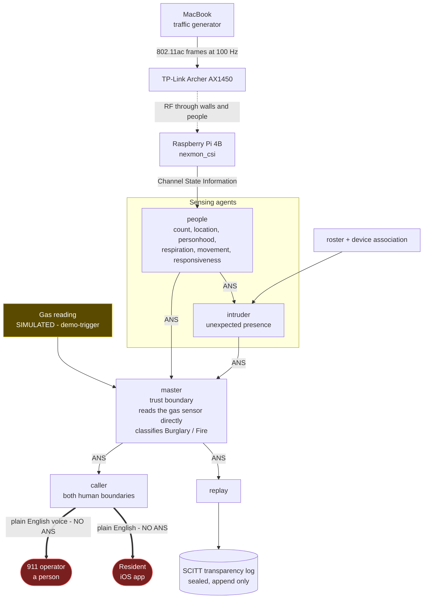
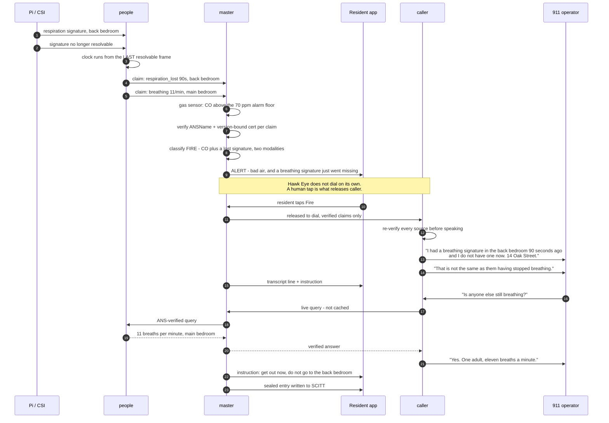
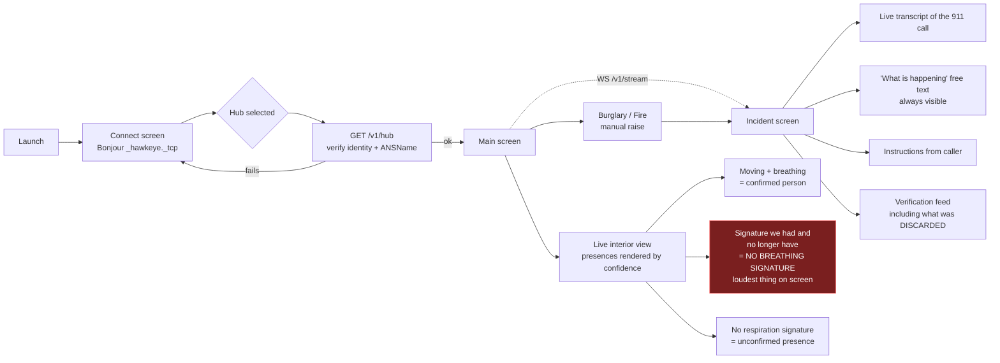
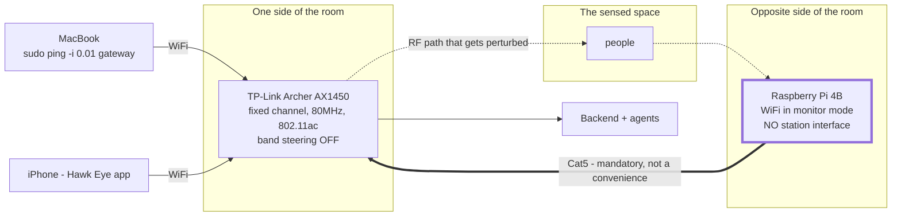

# Architecture diagrams

Source of truth for every Mermaid diagram on the Notion page.
Notion renders these live, but Notion is not version control, so they live here and get pushed there.

**If you change one, change it here first, then push it to Notion.**
Before 2026-09-19 these existed only in Notion and were not backed up anywhere.

## 1. System architecture - the two human boundaries

The asymmetry is the whole architecture.
Human to agent is plain English at both ends. Agent to agent is ANS, every hop.

## 2. The fire path - detection, alert, human tap, call

**Rekeyed 2026-09-19** when the third incident type and fall detection were cut. This diagram used to walk the cut type's path, and the copy in Notion still does.
The choreography is unchanged, because the choreography was never about a fall: something is sensed, the app raises an alert, a human taps, and only then does anyone dial.
What changed is the claim that drives it. It is now elevated CO from the gas sensor plus a breathing signature that `people` had and no longer has, which is two independent modalities rather than two views of one CSI stream.

**Corrected 2026-09-19.** The version that sat in Notion until then went straight from `master` to
`caller` to the operator with no human in between. That contradicted the settled decision, the root
`CLAUDE.md`, and the shipped code, where `assert_human_released()` raises `AutonomousDialRefused`
on exactly that path.

The detection is autonomous. **The call is not.**

## 3. The refusal path

## 4. The iOS app flow

## 5. Hardware topology

