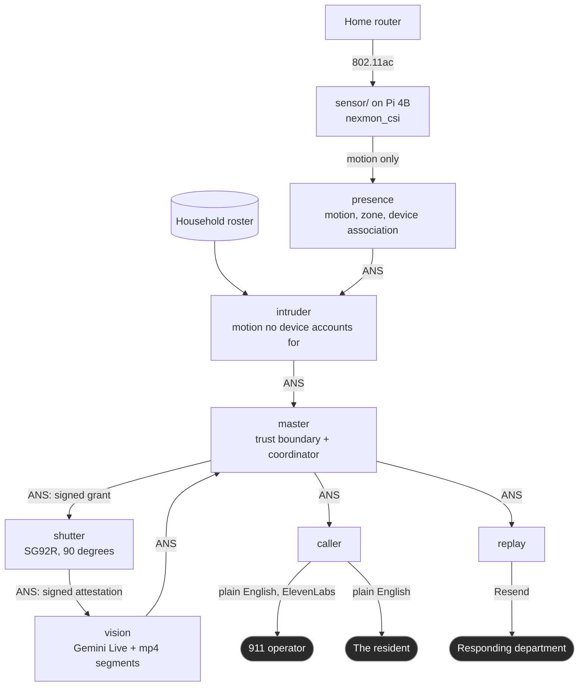
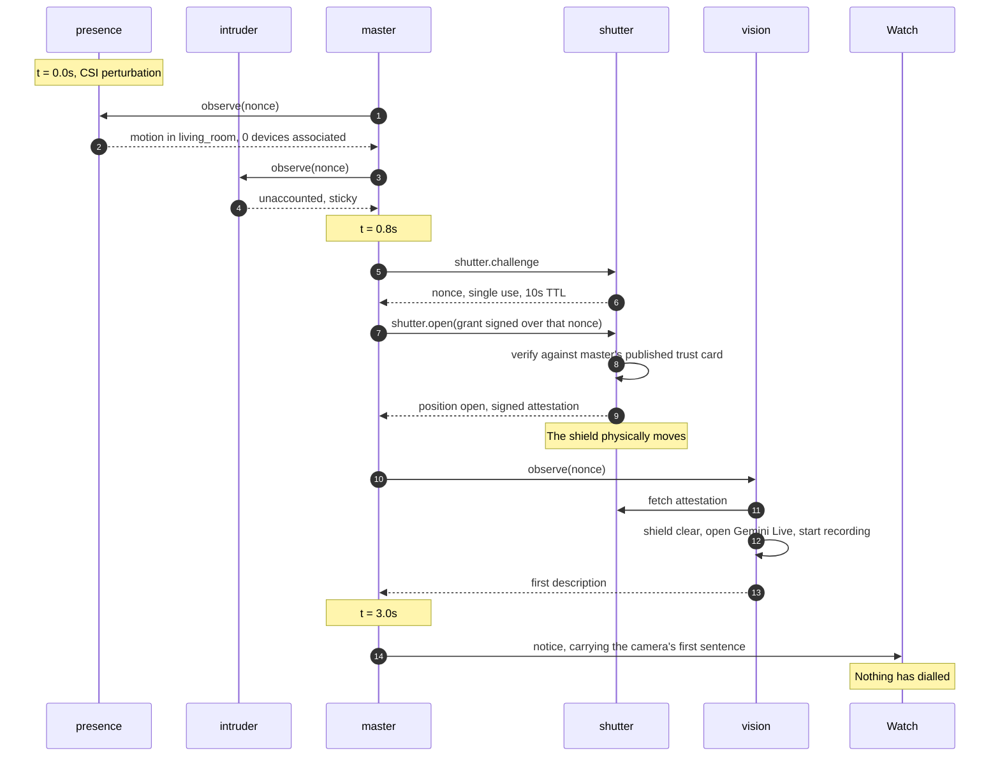
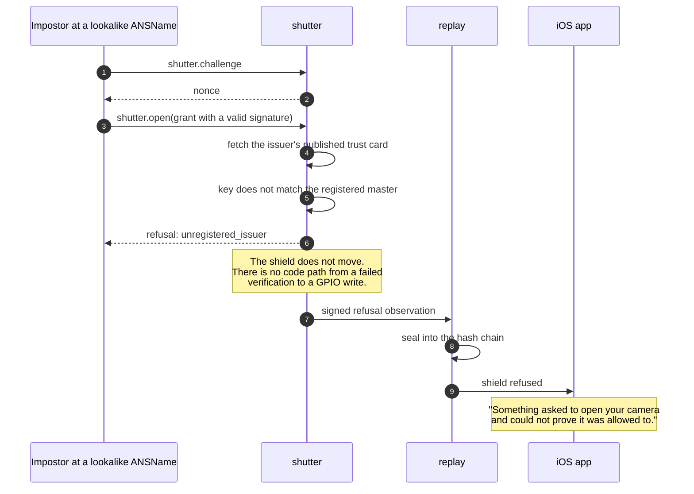
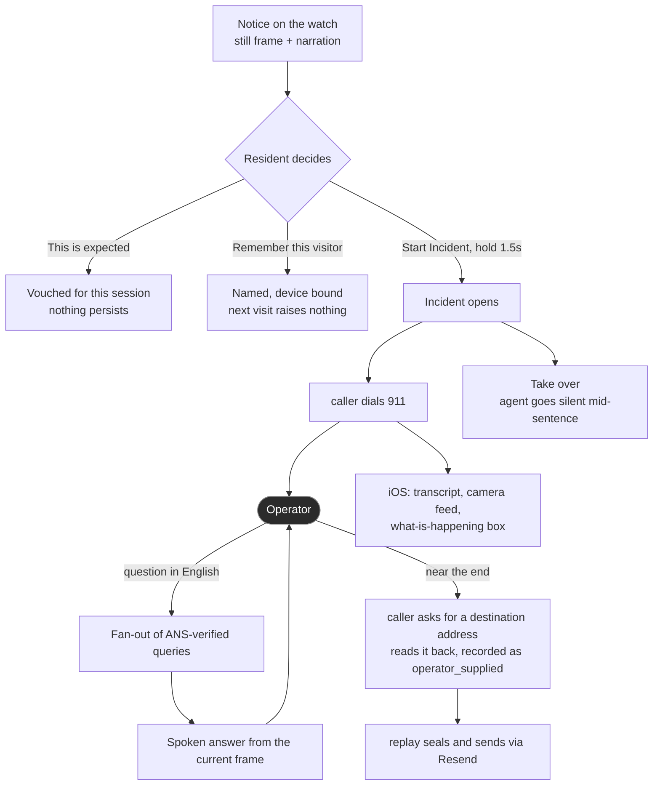
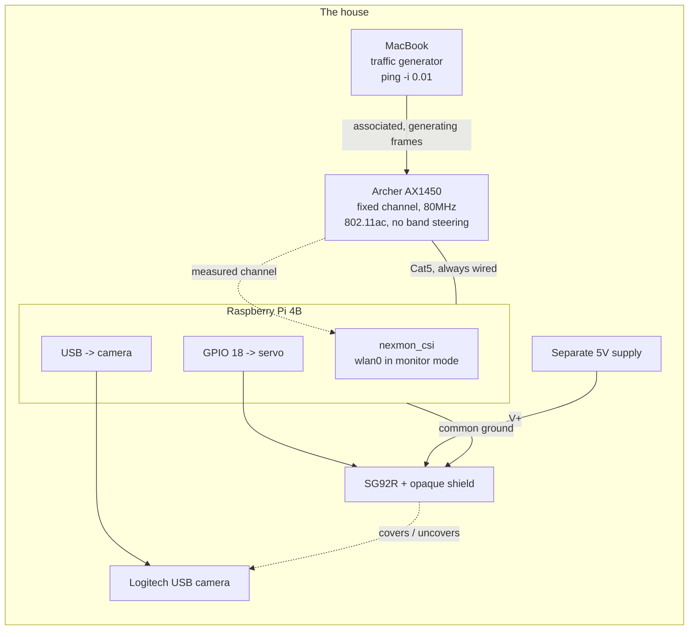
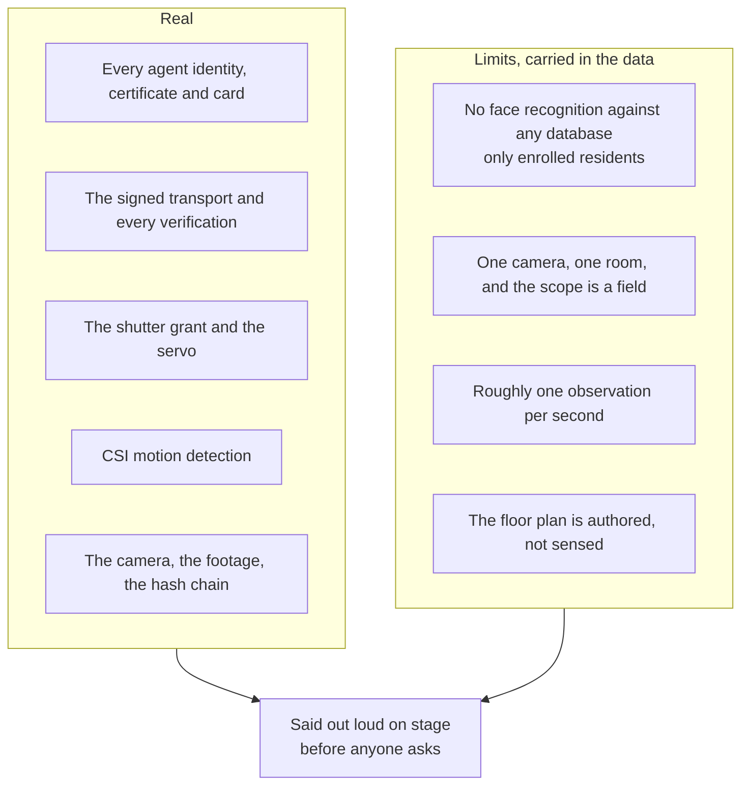

# Architecture diagrams

Source of truth for every Mermaid diagram on the Notion page.
Notion renders these live, but Notion is not version control, so they live here and get pushed there.

**If you change one, change it here first, then push it to Notion.**

**Rewritten 2026-09-19 for the camera pivot.** The previous five diagrams described a respiration-sensing system with two incident types. See `docs/PIVOT.md`.

## 1. System architecture - the two human boundaries

The asymmetry is the whole architecture.
Human to agent is plain English at both ends. Agent to agent is ANS, every hop.

**The two dashed-in-spirit edges are the human ones.** There is no ANS there and there cannot be, because the far ends are people.

## 2. The trigger path - motion to wrist in about three seconds

The only automatic physical action in the system is a shutter opening.

**Step 13 is the claim.** No call exists at this point and `TASKS.md` step 6 of the end-to-end test asserts it.

## 3. The refusal path - the submission

Same sequence, with an impostor in `master`'s place.

**A valid signature is not authorization.** That is the whole difference the fraud battery exists to probe, and here it is a physical object that did not move.

## 4. The human path - watch, phone, operator

**Three of the four branches out of the decision node do not call anyone.** That is the design, not a gap.

## 5. Hardware topology

Three things this diagram is trying to stop you doing:

- **The Cat5 is not optional.** `nexmon_csi` holds the WiFi interface in monitor mode, so there is no station interface while capturing
- **The servo is not on the Pi's 5V rail.** It stalls at over 700mA and browns the Pi out, and the failure presents as the camera or the capture dying
- **The router and the Pi are on opposite sides of the sensed space.** Side by side produces a flat capture that looks exactly like a failed firmware patch. The camera does not share that constraint, because it is on a USB extension

## 6. What is real and what is not

For the honesty slide. Green is real, amber is a limit stated in the data, and there is no red column any more.

**The pivot removed the only genuinely fabricated input in the project.** The simulated gas sensor is gone, and everything remaining is either real or a stated limit.
