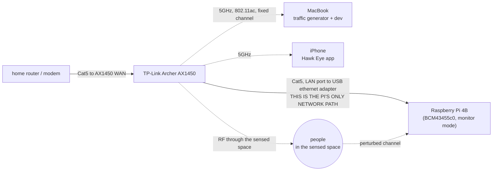

# Assembly and placement

How the four devices physically connect, and where in the room they go.

The wiring is easy.
The geometry is the part people get wrong, and getting it wrong produces a failure that looks exactly like a broken firmware patch.
Read the geometry section before you put anything down.

## The geometry rule

**The Pi measures the channel between whoever transmitted and itself.**

That is the whole model.
The Pi is not scanning a room.
It is measuring one link, and it only sees what perturbs that link.

So:

**Put the router and the Pi on opposite sides of the space being sensed, with people in between.**

```
      router  ))))))))))))  person  ))))))))))))  Pi
        |<--------- the sensed space --------->|
```

A body between the two ends changes the multipath structure of that link, and that change is the measurement.
A body that is not between them changes very little.

### What happens if you ignore it

Router and Pi side by side on one table gives you this:

```
   router ))  Pi
       |
       |  ))))))))  person  (off to the side, barely in the path)
```

The dominant path between router and Pi is now a short, strong, direct line that nothing walks through.
The capture goes flat.

Packets still arrive on port 5500.
Payloads are non-zero.
The extractor is configured correctly.
Nothing errors.
The signal just does not move when people do.

That is indistinguishable, from the outside, from a firmware patch that built and installed and is not extracting properly.
People have spent entire nights rebuilding `nexmon_csi` to fix a table-layout problem.

**If the packet rate is healthy and the signal never moves, suspect the geometry before you suspect the firmware.**

### Why the ping helps here too

`sudo ping -i 0.01 <gateway>` from the MacBook is useful beyond raw frame rate.
Both ends transmit: the MacBook sends requests, the router sends replies.
So you get two links crossing the space rather than one, which makes the sensed volume less dependent on exactly where one box sits.

Place the MacBook thoughtfully for the same reason you place the router.
It is a transmitter, not just a tool.

## Wiring

### The house shoot



Plain text version, which is the one to read at 2am:

```
home router / modem
   └─ Cat5 ─► AX1450 WAN
                AX1450 LAN ─ Cat5 ─► Pi eth0 (USB ethernet adapter)
                AX1450 5GHz ────────► MacBook   (traffic generator)
                AX1450 5GHz ────────► iPhone    (the app)

                AX1450 ))))))))) people ))))))))) Pi   (the measurement)
```

No MacBook in the uplink chain.
Internet Sharing exists only to give a router a wired uplink where there is none, and at the house the uplink is already ethernet.
Dropping it removes three failure points: macOS Internet Sharing, the USB Ethernet adapter in the uplink role, and the 192.168.2.x subnet collision.

Double NAT is fine.
All agent traffic is outbound to Vultr.

**Channel separation matters here.**
The Pi monitors exactly one channel.
If the demo router and the household's existing network share it, household traffic contaminates the capture.
Check what the home network is on and take a different non-DFS channel.
See [router-archer-ax1450.md](router-archer-ax1450.md).

Decide before filming whether the Pi needs internet at all.
If the sensing agents run on a laptop on the same LAN rather than on Vultr, the uplink stops mattering during the take, which is one less thing that can break on camera.

### The venue fallback

We are demoing live at judging, but **not the sensing pipeline**.
The agents run from Vultr and the CSI is replayed from the session captured at the house.
The Pi and router come for a prop and for one honest live bit: **movement response**.
No calibration, no baseline, no through-wall claim.
A judge waves a hand and the signal moves.

The reason the rest stays in the video is principled, not an excuse.
Counting and localization need a baseline, and a hall cannot supply a usable one: the baseline decays as the room fills because bodies are reflectors, and occupancy assumes a bounded space that an open hall does not have.
Motion and breathing need no baseline at all, which is exactly why they survive a judging table.

If the Pi is powered up at the venue, this is the chain:

```
venue Wi-Fi or phone hotspot
   └─► MacBook (macOS Internet Sharing: Wi-Fi source ─► USB Ethernet)
          └─ Cat5 ─► AX1450 WAN
                       AX1450 LAN ─ Cat5 ─► Pi eth0
                       AX1450 5GHz ────────► traffic generator
```

Constraints specific to this path:

- **Router LAN subnet must not be 192.168.2.x.** It collides with macOS Internet Sharing's NAT range.
- **Captive-portal venue Wi-Fi cannot be shared.** Fallback is USB tethering a phone and sharing that.
- The MacBook cannot be both the Internet Sharing source and the traffic generator, because sharing requires it to be associated to the venue network rather than the AX1450. At a venue, pick one. For the movement bit, beacons plus an associated phone are enough.

On a judging table, the two boxes will be close together.
That is unavoidable and it is fine for a movement demo, because a hand waved directly between them is squarely in the path.
Do not attempt anything else from that layout.

## Placement, concretely

### At the house

Pick the room the incident is filmed in, then:

1. Put the router against one wall of that room.
2. Put the Pi against the opposite wall.
3. The action happens between them.

For a through-wall shot, put the router in one room and the Pi in the adjacent room, with the wall and the person between them.
Test this before filming.
If 5GHz does not penetrate well enough, `sensor/CLAUDE.md` allows falling back to 2.4GHz channel 1 at 20MHz: worse resolution, better penetration.
Test both at the house, not on the night.

Separation distance: `TBD - decide and record here.`
How to determine it: start at roughly room width, typically 3 to 5 metres, and walk it in and out while watching the signal respond to someone crossing the middle.
Record what actually worked in the house you film in.
Too close and the direct path dominates; too far and there is not enough signal.

### Mounting height

Put both the router and the Pi at roughly torso height for a standing adult.

The reasoning: the strongest respiration signal comes from chest-wall displacement, so the link should pass through chests rather than over heads or along the floor.

## Range

Range is **per capability**, not one number. It scales with how much the body perturbs the channel:
gross motion moves decimetres, breathing moves the chest 5-12mm, a heartbeat moves it about 0.5mm.
Each order of magnitude smaller costs range.

| Capability | Line of sight | Through one drywall wall |
|---|---|---|
| Motion / presence | 5-10 m | ~5 m |
| A motion transient | 5-10 m | ~5 m |
| Occupancy and zone | 4-8 m, degrades as count rises | 3-5 m |
| **Respiration** | **2-4 m, best under 3** | 2-3 m, marginal |
| Heart rate | under 2 m, often under 1 | do not attempt |

RuView's stated figure is ~5 m through-wall, signal dependent, which matches the top rows.

**These are literature and vendor figures, not our measurements.** The only numbers that matter are the ones measured in the house. See the range test below.

### It is an ellipsoid, not a radius

The Pi measures the channel **between the transmitter and itself**, so the sensitive region runs *along the line between router and Pi*. It is not a sphere centred on the Pi.

A person 2 m from the Pi but off to one side perturbs the link far less than a person 5 m away standing directly between the two endpoints.
This is the same fact as the opposite-walls placement above, stated as a range limit.

There is also a **lower** bound on separation. Closer than about 2 m the direct path is strong enough to swamp the body reflection.
That is why the 3 to 5 m figure above is a sweet spot rather than a minimum.

### Walls

| Barrier | Expect |
|---|---|
| One interior drywall wall | Works. **This is the claim to make.** |
| Two walls | Degraded. Motion often survives; respiration usually does not |
| Brick, concrete, tile backer board | Hard stop |
| Metal: appliances, mirrors, foil-backed insulation | Blocks outright |

Foil-backed insulation is the one that catches people out. It is invisible and it kills the link completely.
If a wall performs far worse than expected, suspect it before suspecting the firmware patch.

**2.4 GHz penetrates better**, roughly 3-5 dB per drywall wall against 5-8 dB at 5 GHz.
The cost is fewer subcarriers at 20 MHz and therefore coarser respiration.
Decision rule: if the through-wall shot will not hold at 5 GHz, drop to 2.4 GHz ch 1 and accept the coarser signal.

### Extending range: what works, ranked

Settled 2026-09-19, after considering and rejecting a WiFi extender.

**Do not buy an extender.** It adds a second transmitter in a different place, so the CSI stream becomes frames
from two geometries mixed together. Separating them properly needs two baselines, two Fresnel geometries and fusion logic.
Extenders also receive-then-retransmit, which adds jitter to the frame timing the respiration detector depends on,
and they default to client steering, which we disabled on the router for exactly this reason.

What to do instead, in order:

**1. Place the MacBook deliberately. It is already a second transmitter.**

The traffic generator pings the gateway, so ping requests leave the MacBook and replies leave the router.
The Pi captures frames from both. Two links from two locations already exist.

```
router ───────────── Pi ───────────── MacBook
       link A                link B
```

Put the MacBook at the **far end of the space, opposite the router**, so the two links cover different corridors.
This is what the extender would have bought, without the jitter or the client steering.

`nexmon_csi` tags each CSI packet with the source MAC, so the two streams can be separated in software later
for proper multi-viewpoint fusion. That is roadmap, but the placement benefit is immediate and free.

**2. Trade latency for range, per capability.**

Respiration is periodic, so integrating over more cycles averages the noise down. A 60 second window instead of
10 buys real distance, and it is a software parameter.

| | Needs | Can afford |
|---|---|---|
| A motion transient | speed; it is a transient | short window, and the signal is large anyway |
| Respiration | range | **slow. A 30-60s answer is fine** |

"Is someone breathing in the back bedroom" does not need to resolve in two seconds.
Let that detector be patient and it reaches further.

**3. Stretch the baseline.** Push router-to-Pi toward 6-8 m along the path being filmed. Past that, SNR loses the body reflection.

**4. Aim the router antennas.** Vertical, perpendicular to the sensing line, chest height. Worth a few dB and free.

**5. Transmit power to High.** TP-Link firmware exposes High/Medium/Low and often defaults to Medium.

**6. Band: measure, do not assume.** The tradeoff is two-sided.

- **2.4 GHz wins on propagation.** 3-5 dB per drywall wall against 5-8. Better motion reach and more walls.
- **2.4 GHz is intrinsically less sensitive to breathing.** At λ=125mm a 20mm round-trip chest excursion gives about 58 degrees
  of phase change; at 5 GHz's λ=60mm it gives about 120. Fewer subcarriers at 20 MHz also costs the diversity that
  rescues you from Fresnel nulls.

So 2.4 GHz for motion reach, 5 GHz for respiration quality. Run both in the range test below and let the numbers decide.

### The range test, before committing to a shot list

Twenty minutes. Do it once, write the numbers down.

1. Router and Pi on opposite walls, 3 to 5 m apart, chest height.
2. One person walks the midline. Note where motion stops registering.
3. Same person lies still at 2 m, 3 m, 4 m. Note where respiration stops being clean.
4. Repeat 2 and 3 with the wall between them.

### The two-person test

Counting is the weak capability on a 1x1 radio. Run this before any shot that implies two people.

5. One person mid-room. Note the signal.
6. Second person enters and stands in the **opposite corner**. Does the count move?
7. Second person walks to within **1m** of the first. Does it collapse back to one? Expect that it does.
8. Both lie still. Can two respiration peaks be resolved in the 0.1-0.5 Hz band, or do they overlap?

**Step 8 decides whether "two people" appears anywhere in the video.** If the peaks overlap, do not claim a sensed count.
Take the headcount from device association against the roster instead and let the radio answer which room and whether that presence is breathing. See `agents/CLAUDE.md` under `agents/people`.

**Step 3 decides where the still, breathing subject is staged.** Respiration is the shortest-range capability the demo depends on, so it sets the geometry.
Motion will work almost anywhere and is not the constraint.

Cross-check against the Fresnel note in `sensor/CLAUDE.md`: if respiration looks absent at a distance that should work, move the subject a few inches before concluding the range ran out.
Torso height is also a reasonable compromise for someone lying down, where the body ends up low, because what the radio sees is a change in the path rather than an absolute level.

A shelf, a stack of books, or a tripod all work.
Do not put either box on the floor, and do not put either on top of a tall bookcase.

Record the height used: `TBD - decide and record here.`
How to determine it: measure what you used at the house and write it down, so the shot is reproducible if you have to reshoot.

### Orientation

Keep the AX1450's antennas vertical and fanned out, not bunched.
The Pi's antenna is internal, so orientation of the board matters less, but keep it out of a metal enclosure and do not lay it flat against a metal surface.

## What to keep out of the path

Everything in this list changes the channel in ways that have nothing to do with people.

| Avoid | Why |
|---|---|
| Large metal surfaces: fridges, filing cabinets, metal shelving, steel doors | Strong reflectors. They create dominant static paths that swamp the human perturbation. |
| Mirrors and large glass | Effectively reflective at these frequencies. Same problem. |
| Microwave ovens, in use | Broadband interference in the 2.4GHz band. Fatal to a 2.4GHz fallback capture, and a nuisance even at 5GHz. |
| Cordless phone bases, baby monitors, Bluetooth-heavy clusters | Co-channel interference and uncontrolled traffic. |
| Other people's Wi-Fi on the same channel | Contaminates the capture. This is why the channel is chosen after a scan. |
| Fans, oscillating or ceiling | Periodic motion. A fan is exactly the kind of non-human periodic perturbation `agents/people` is supposed to reject, so do not make its job harder for no reason during a take. |
| Pets wandering through, unless they are in the script | Same reason. |
| The Pi inside a metal case | Detunes the internal antenna. |

Also: **do not move furniture mid-session.**
The rolling baseline adapts over minutes, not seconds, by design, so a sofa shifted halfway through a take is a perturbation the system will treat as real for a while.

## Power

These are hard constraints and two of them corrupt SD cards.

- **Pi power: the kit's 5V/3A USB-C wall supply, always.** The Pi 4B's USB-C port is power-only. A Pi under Wi-Fi capture load draws enough that a marginal supply browns out, and a brownout corrupts the microSD rather than producing a clean reboot.
- **Never power the Pi from a router USB port.** Same failure, reliably.
- **Never power the Pi from a laptop USB port.** Same failure.
- Router on its own supply.
- Do not rely on one power strip that someone can kick. If the Pi loses power mid-capture you lose both the session and possibly the card.
- At a venue, find out whether the judging table has power before you plan on the Pi being up.

If the card does corrupt, the recovery is the `dd` image taken the moment CSI first flowed.
If that image does not exist, there is no recovery.
See [raspberry-pi-4b.md](raspberry-pi-4b.md) step 8.

## A quick physical sanity pass

Before you start a capture, walk the room once and confirm:

- Router and Pi are on opposite sides of the space, at torso height, with the action between them
- The Cat5 runs from a router LAN port to the Pi's USB ethernet adapter, and is actually seated at both ends
- The Pi is on its own 5V/3A wall supply
- Nothing large and metal, and no mirror, sits directly between router and Pi
- No fan is running in the sensed space
- The MacBook is associated to the 5GHz SSID, not the 2.4GHz one, and its PHY Mode reads 802.11ac
- The traffic generator is running
- Nobody is about to move the furniture
