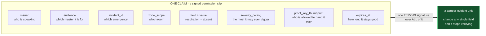
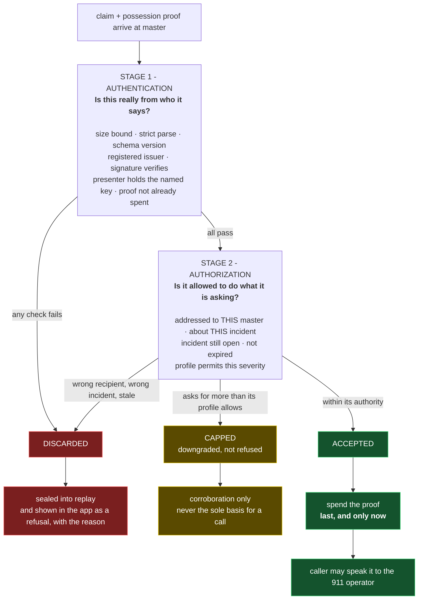
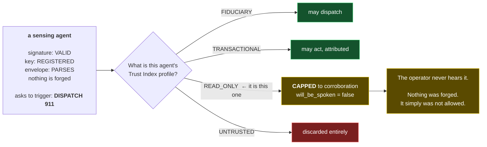
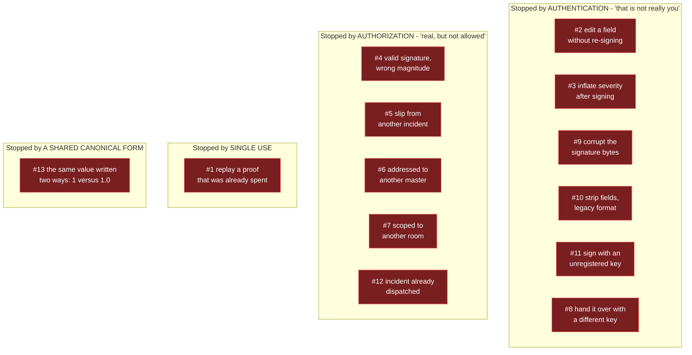

# The trust layer, explained

**Pivot note, 2026-09-19.** The trust layer is untouched by the camera pivot; this file's mechanics are all still correct.
Two substitutions when you read it: the roster is seven agents rather than five, and the canonical "something valuable moves" example is now a servo uncovering a camera lens rather than an armed response to an address. The second is the one to use on stage, because a judge can watch it happen.
See `docs/PIVOT.md`.

What `agents/master` actually does to a claim before `agents/caller` is allowed to say it out loud,
and what the thirteen `fraud.webmesh.ai` attacks are trying to do to it.

This is the abstract part of the project. The other diagrams in `architecture-diagrams.md` show
what happens; this one shows why any of it can be believed.

## Start here: a claim is a signed permission slip

A sensing agent never just "reports a number". It issues a slip that reads, in effect:

> I, the people agent, say the person in the main bedroom has stopped breathing.
> This slip is for the master at *this* house, about incident #1234, about the *main bedroom*,
> it is good for five minutes, only the holder of *this* key may hand it over,
> and it is strong enough to justify calling 911.

Every clause in that sentence is a lock.
**The thirteen attacks are thirteen ways of trying to pick one of them.**



Why sign the whole slip rather than just the reading: so that "respiration irregular" cannot be
edited into "respiration absent" somewhere between the sensor and the dispatcher. That edit is the
Infinite Impostor, and it is the attack this project exists to stop.

## The two stages, and why the second one is the interesting one

Verification is not one question. It is two, in order.

**Stage 1 asks "is this real?"** - is the signature good, is the key registered, has this proof
been used before.

**Stage 2 asks "is it allowed to do this?"** - a perfectly real slip can still be the wrong slip.



Two details in that diagram are load-bearing and easy to miss.

**The proof is spent last.** Not when it arrives - after every other check has passed. If a
rejected claim burned its proof id, anyone submitting garbage could fill a fixed-size cache and
fail-close authentication for every honest agent. On this system that is a denial of service
against a 911 call.

**A discard is a product feature, not an error.** It gets sealed and it gets rendered on the
resident's phone with its reason. "The agent that speaks to 911 only repeats claims it can verify,
and it tells you what it discarded" is only checkable because the discard is a first-class object.

## The one idea worth taking away

This is the sentence the whole design turns on:

**A valid signature is not authorization.**

Ten of the thirteen attacks pass only if that is true. The clearest case is attack #4: nothing is
forged at all. The signature is genuine, the key is registered, the slip parses perfectly. It is
refused anyway, because the agent that issued it is not permitted to trigger what it is asking for.



The everyday version: a real employee badge that opens the front door does not open the vault.
Checking *who you are* and checking *what you may do* are different checks, and systems that
collapse them into one are the ones that get robbed.

## Where each of the thirteen attacks dies

Grouped by which property stops it, which is more useful than the numbering.



#13 is the odd one out and the most likely to bite us for ordinary reasons. It is not really an
attack: it is two agents writing the same number differently, producing signature mismatches that
look exactly like tampering. The defence is that there is exactly one canonicalizer in the
codebase and every agent uses it.

## What this does not do

Say this before a judge does.

The 911 operator is a person on a phone. No signature, certificate, or transparency log reaches
them. Everything above governs the machine hops *behind* the voice. The operator cannot verify us
live, and we do not claim they can - what they get is a voice, and what an investigator gets
afterwards is a sealed, tamper-evident record of exactly who claimed what.

## Where it lives in code

| Part of the diagram | File |
|---|---|
| The permission slip | `app/backend/hawkeye_backend/verification/envelope.py` |
| Both stages, in order | `app/backend/hawkeye_backend/verification/verifier.py` |
| Registered agents and profiles | `app/backend/hawkeye_backend/verification/trust.py` |
| Single use, spent last | `app/backend/hawkeye_backend/verification/replay.py` |
| The one canonicalizer | `app/backend/hawkeye_backend/verification/canonical.py` |
| All thirteen attacks, as tests | `app/backend/tests/test_battery.py` |

```sh
cd app/backend && python -m pytest -q   # 37 passed
```

Deeper reading: `docs/fraud-13.md` for the per-attack translation, `ans/CARD.md` for the agent-card
side, `docs/threat-landscape.md` for why any of this is the right threat model.
